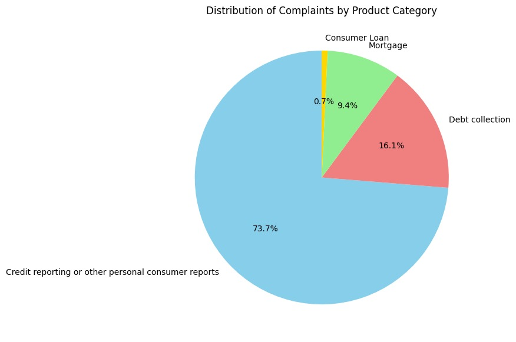
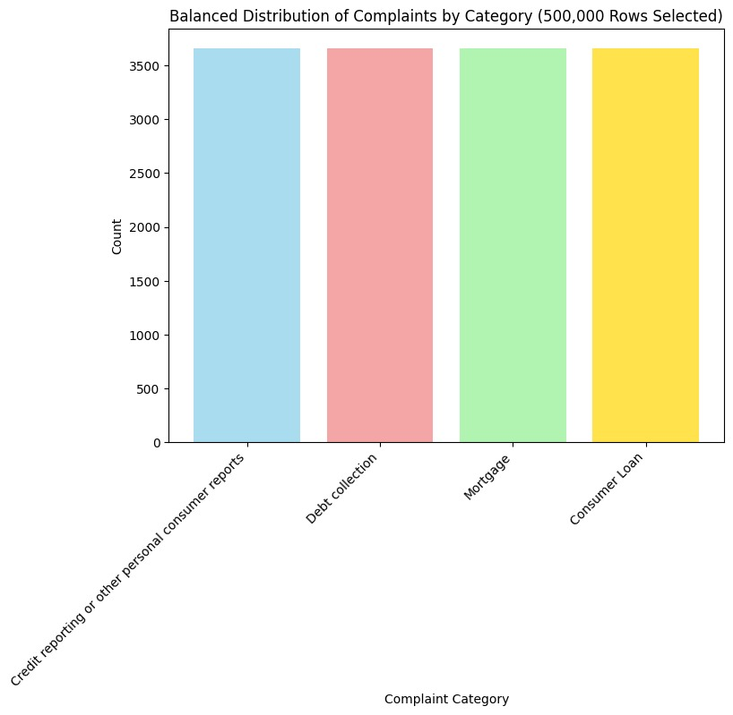

# Task-5-Data-Science---Text-Classification-on-consumer-complaint-dataset


## 1. Introduction
Consumer complaints contain valuable insights that can be used to categorize issues into predefined categories for better customer support and trend analysis. In this project, we classify consumer complaints into four categories:

- **Credit Reporting, Credit Repair, or Other Personal Consumer Reports**
- **Debt Collection**
- **Consumer Loan**
- **Mortgage**

We employ various machine learning and deep learning models to analyze, process, and classify textual data. This document outlines the key steps in the data processing pipeline and evaluates different models for classification performance.

## 2. Explanatory Data Analysis and Feature Engineering
Before applying machine learning models, we analyze the dataset to understand its structure, distribution, and potential issues. Key steps include:

- **Loading the dataset**: Extracting relevant columns (e.g., Product, Issue, Sub-Issue, and Consumer Complaint Narrative).
- **Checking for missing values**: Identifying and handling missing or inconsistent values.
- **Class Distribution Analysis**: Visualizing the number of complaints in each category using bar charts and pie charts.
- 
- 
- **Text Length Analysis**: Checking the distribution of complaint text lengths.
- **Balancing the Dataset**: Applying undersampling to ensure equal representation of categories for fair model training.

## 3. Text Pre-Processing
Since we are dealing with textual data, effective preprocessing is essential. We apply the following steps:

- **Lowercasing**: Converting all text to lowercase for uniformity.
- **Removing Special Characters**: Eliminating punctuation, symbols, and extra spaces.
- **Tokenization**: Splitting text into meaningful words.
- **Stopword Removal**: Removing common words like "the," "is," and "and" that do not contribute to meaning.
- **Lemmatization**: Reducing words to their base forms (e.g., "running" → "run").
- **Combining Text Features**: Merging Issue, Sub-Issue, and Consumer Complaint Narrative into a single input feature.
- 

  

## 4. Selection of Multi-Classification Model
We experiment with multiple models to determine the best approach for text classification:

### Machine Learning Models:
- Logistic Regression
- Random Forest
- Support Vector Machine (SVM)
- Multinomial Naïve Bayes (MNB)

### Deep Learning Models:
- Convolutional Neural Network (CNN)
- My Own Custom Neural Network
- Long Short-Term Memory (LSTM)
- Deep Neural Networks (DNN)

Each model is trained and evaluated on the dataset using the same train-test split to ensure fair comparison.

## 5. Comparison of Model Performance
To evaluate model performance, we compare:

- **Accuracy**
- **Precision, Recall, and F1-Score**
- **Confusion Matrix**
- **Training vs Validation Loss** (for deep learning models)
- **Training vs Validation Accuracy Curve** (for deep learning models)

We visualize these metrics to assess which model performs best in terms of classification effectiveness.

## 6. Model Evaluation
Each model's predictions are analyzed using:

- **Confusion Matrix**: To understand misclassifications and areas for improvement.
- **Precision, Recall, F1-Score**: To evaluate classification effectiveness.
- **Training Graphs for Deep Learning**: To check overfitting or underfitting.

- ## Model Performance Comparison

| Model                 | Precision | Recall | F1-Score | Accuracy |
|-----------------------|-----------|--------|----------|----------|
| **Logistic Regression** | 0.98 - 0.99 | 0.98 - 0.99 | 0.98 - 0.99 | **0.98** |
| **Random Forest**      | 0.99 - 1.00 | 0.99 - 1.00 | 0.99 - 1.00 | **0.99** |
| **SVM**               | 0.98 - 0.99 | 0.98 - 0.99 | 0.98 - 0.99 | **0.99** |
| **Naïve Bayes**       | 0.96 - 0.99 | 0.96 - 0.99 | 0.97 - 0.99 | **0.98** |
| **Deep Neural Network (DNN)** | 0.90 - 0.98 | 0.89 - 0.98 | 0.93 - 0.98 | **0.96** |
| **Convolutional Neural Network (CNN)** | 0.95 - 0.98 | 0.91 - 1.00 | 0.94 - 0.98 | **0.96** |
| **Custom Neural Network** | 0.95 - 0.98 | 0.91 - 1.00 | 0.94 - 0.98 | **0.96** |

### Notes:
- Precision, Recall, and F1-Score are provided as a range across all classes.
- Accuracy is based on the total dataset performance.
- Models like Random Forest and SVM achieve **high accuracy**, but deep learning models may generalize better with more data.


We interpret these results to determine the best model for deployment.

## 7. Prediction
Once the best model is selected, we create a prediction function to classify new consumer complaints. The function follows these steps:

- **Preprocessing Input Text**: Applying the same cleaning steps as the training data.
- **Vectorizing Input Text**: Using TF-IDF for ML models and Tokenization for DL models)
- **Making Predictions**: Using the trained model to classify the complaint.
- **Returning the Category Name**: Mapping the numeric prediction to a human-readable category.
-  

### Example:
```python
sample_text = "Having issues with my credit report and disputing an error"
predicted_category = predict_complaint(sample_text)
print("Predicted Category:", predicted_category)
```

## 8. Conclusion
This project demonstrates how machine learning and deep learning techniques can be applied to categorize consumer complaints efficiently. Our analysis highlights:

- The importance of preprocessing and feature engineering in text classification.
- The strengths and weaknesses of different models in handling real-world complaint data.
- The use of deep learning CNN for improved classification when sufficient data is available.
- The potential for future improvements such as hyperparameter tuning, ensemble methods, and transformer-based models (BERT).
